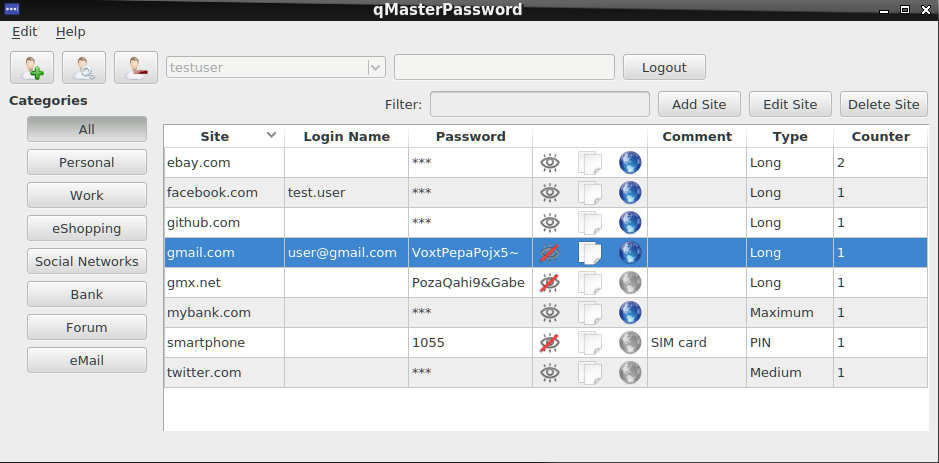

### qMasterPassword ###

qMasterPassword is a password manager based on Qt. Access all your passwords
using only a single master password. But in contrast to other password managers
it does not store any passwords: Unique passwords are generated from the master
password and a site name. This means you automatically get different passwords
for each account and there is no password file that can be lost or get stolen.
There is also no need to keep a list with all the passwords since they are
generated, and no need to trust any online password service.

The algorithm is described here: 
http://masterpasswordapp.com/algorithm.html
This page also contains other compatible software for various platforms, like
Android or iOS.

See also http://masterpasswordapp.com/what.html to get more familiar with the
concept and reasons why to use it.

qMasterPassword is developed on Linux, but it should be easy to get it to work
on other platforms if the dependencies are met.

#### Dependencies ####
* Qt 5.2 or higher (see branch qt4.8 for older Qt version support)
* OpenSSL (libcrypto library)
* libscrypt library (https://github.com/technion/libscrypt for Linux/OSX,
  https://github.com/barrysteyn/scrypt-windows for Windows)

#### Build ####
`$ qmake`  
`$ make`  
`$ ./qMasterPassword`  

#### Usage ####
Keyboard: When the list view has focus:
- [Y]/[Space]: copy password of selected entry to clipboard
- [/]: focus the filter input
- [J]/[K]: Select next/previous item

#### Testing ####
`$ make debug`  
Run unit tests:  
`$ ./qMasterPassword --test test/tests.xml`

#### Miscellaneous ####
if you have any improvements or suggestions you are welcome to implement them
and/or contact me.

Copyright 2015 Beat Küng <beat-kueng@gmx.net>

