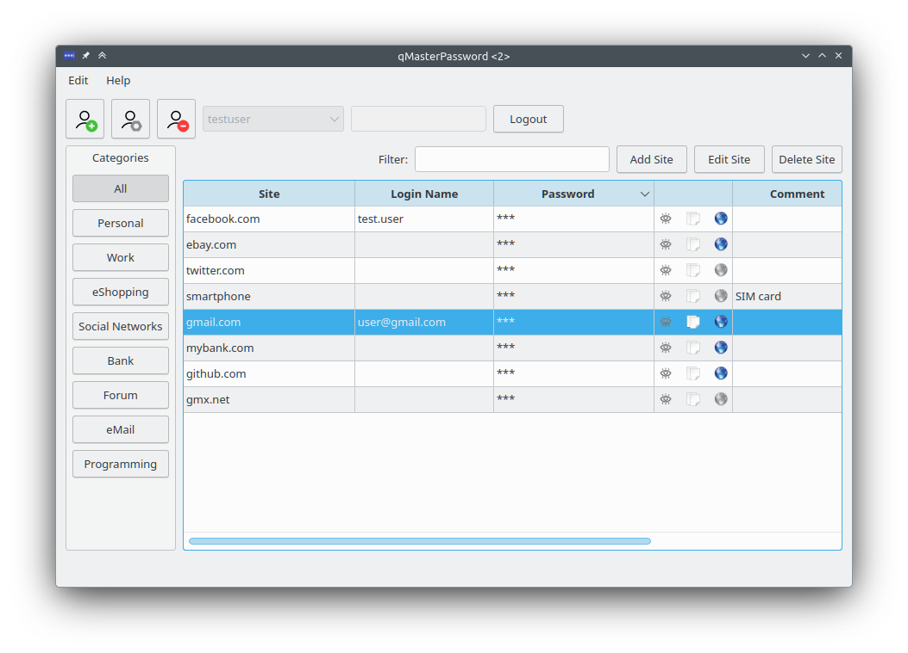

[](https://github.com/bkueng/qMasterPassword/actions/workflows/build.yml?query=branch%3Amain+event%3Apush)
[](https://travis-ci.org/bkueng/qMasterPassword)
[](https://scan.coverity.com/projects/4067)

### qMasterPassword

qMasterPassword is a password manager based on Qt. Access all your passwords
using only a single master password. But in contrast to other managers it does
not store any passwords: Unique passwords are generated from the master password
and a site name. This means you automatically get different passwords for each
account and there is no password file that can be lost or get stolen. There is
also no need to trust any online password service.

See [this introduction page](https://spectre.app/#introduction) to get more familiar with the concept
and reasons why to use it.

The algorithm is described [here](https://spectre.app/spectre-algorithm.pdf).

The [Spectre home page](https://spectre.app) also contains other compatible software for various platforms, like
Android or iOS.

qMasterPassword is developed on Linux and also tested on Windows. For Windows
there are prebuilt binaries under
[releases](https://github.com/bkueng/qMasterPassword/releases).




#### Dependencies
* Qt 5.2 or higher (see branch qt4.8 for older Qt version support)
* cmake, make or ninja
* OpenSSL (libcrypto library)
* Linux/OSX: [libscrypt](https://github.com/technion/libscrypt) library

  On Debian/Ubuntu, it is available as `libscrypt-dev`.

  On RedHat/Fedora, it is available as `libscrypt-devel`.

* Windows: [scrypt-windows](https://github.com/barrysteyn/scrypt-windows) has been added as
a git submodule.

  You need to add `--recurse-submodules` to the `git clone` command line.

* Linux: libX11 libXtst


#### Build
```shell
cmake [-GNinja] -B build .
cmake --build build
./build/qMasterPassword
```

Add `-GNinja` if you want to build with `ninja` instead of `make`.


#### Usage
Keyboard: When the list view has focus:
- [Y] / [Space] / [Ctrl]+[C]: copy password of selected entry to clipboard
- [U]: Copy login/user name of selected entry to clipboard
- [P] / [Ctrl]+[V]: switch to next window and fill out username and password
- [SHIFT] + [P]: switch to next window and fill out password
- [O]: Open Url
- [/]: focus the filter input
- [J] / [K]: Select next/previous item
- [Q]: Logout


#### Testing
```shell
cmake [-GNinja] -DCMAKE_BUILD_TYPE=Debug -B build .
cmake --build build --target test
```

Add `-GNinja` if you want to build with `ninja` instead of `make`.


#### Miscellaneous
If you have any improvements or suggestions you are welcome to implement them
and/or contact me.
